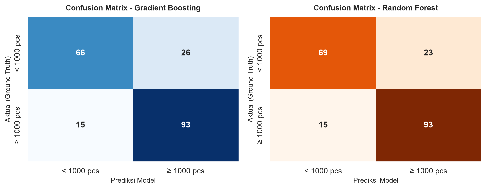
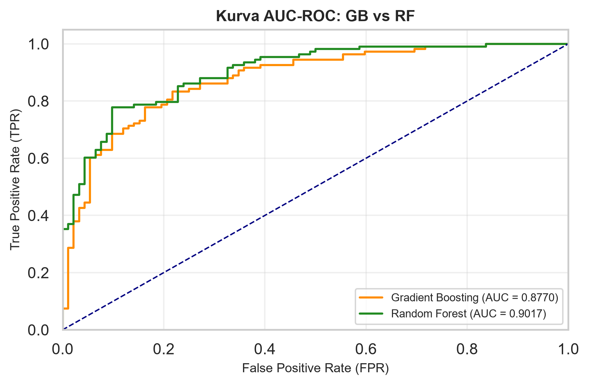

# E-Commerce Sales Prediction for Phone Cases using Machine Learning

Proyek ini bertujuan untuk memprediksi keberhasilan tingkat penjualan produk casing ponsel pada platform e-commerce X menggunakan algoritma Gradient Boosting dan Random Forest dengan mengombinasikan fitur Numerik serta ekstraksi fitur teks (TF-IDF).

```

---

## Features & Methodology

1. Data Cleaning :Pembersihan data tabular (harga,diskon, panjang teks) 
Data Preprocessing: Pembersihan data tabular serta pra-pemrosesan teks (Case Folding, Cleaning, Tokenization, Stopword Removal) pada nama dan deskripsi produk.

Feature Engineering & TF-IDF: Ekstraksi 7 fitur numerik (harga, harga coret, rating, jumlah foto, persen diskon, panjang nama, panjang deskripsi) digabung dengan 500 fitur kata TF-IDF dari teks casing ponsel.

Data Splitting: Pembagian data menggunakan Stratified Train-Test Split (80% Training, 20% Testing) untuk menjaga proporsi distribusi kelas target.

Model Training (SMOTE & Hyperparameter Tuning): Penanganan data tidak seimbang (imbalanced data) menggunakan SMOTE pada data latih, dilanjutkan dengan optimasi hyperparameter menggunakan RandomizedSearchCV (3-Fold Cross Validation).

Model Evaluation: Evaluasi komprehensif menggunakan Accuracy, Precision, Recall, F1-Score, Confusion Matrix, dan Kurva ROC-AUC.

Feature Importance: Analisis kontribusi fitur numerik dan fitur kata TF-IDF teratas dalam mempengaruhi hasil prediksi model.

---

---

## Ecommerce-sales-prediction-ta/
│
├── data/                    # Dataset mentah produk casing ponsel (.csv)
├── models/                  # Saved models & TF-IDF vectorizer (.pkl)
├── notebooks/               # Jupyter / Google Colab Notebooks (.ipynb)
├── src/                     # Modular Python scripts
│   ├── __init__.py
│   ├── data_preprocessing.py # Data & text cleaning pipeline
│   ├── feature_engineering.py # Numeric & TF-IDF feature extraction
│   ├── train.py             # Stratified Split, SMOTE, & RandomizedSearchCV
│   ├── evaluate.py          # Classification report, Confusion Matrix, & ROC-AUC
│   ├── eda_visualize.py     # Exploratory Data Analysis plotting scripts
│   └── feature_importance.py# Feature importance analysis & visualization
├── .gitignore               # Git ignore configuration
├── main.py                  # Entry point utama pipeline
├── README.md                # Dokumentasi proyek
└── requirements.txt         # Library dependencies
```

---

## Model Performance Summary

| Algorithm Model | Accuracy | ROC-AUC Score | Status |
| :--- | :---: | :---: | :---: |
| **Random Forest Classifier** | **81.00%** | **0.9017** | Best Model |
| **Gradient Boosting Classifier** | **79.50%** | **0.8770** | Baseline |
---

---
### 📸 Visualizations

| Confusion Matrix (GB vs RF) | Kurva AUC-ROC |
| :---: | :---: |
|  |  |

---

---
### 🚀 How to Run
Clone Repository:

Bash
git clone [https://github.com/USERNAME_KAMU/ecommerce-sales-prediction-ta.git](https://github.com/USERNAME_KAMU/ecommerce-sales-prediction-ta.git)
cd ecommerce-sales-prediction-ta
Install Dependencies:

Bash
pip install -r requirements.txt
Jalankan Pipeline Prediksi:

Bash
python main.py
Cara Mengaplikasikannya di VS Code:
Blok seluruh isi file README.md kamu (Ctrl + A).

Tempel (paste) kode rapi di atas (Ctrl + V).

Simpan file (Ctrl + S).

Jalankan perintah ini di terminal untuk mengunggah pembaruan ke GitHub:

Bash
git add README.md
git commit -m "docs: finalize clean README documentation"
git push origin main